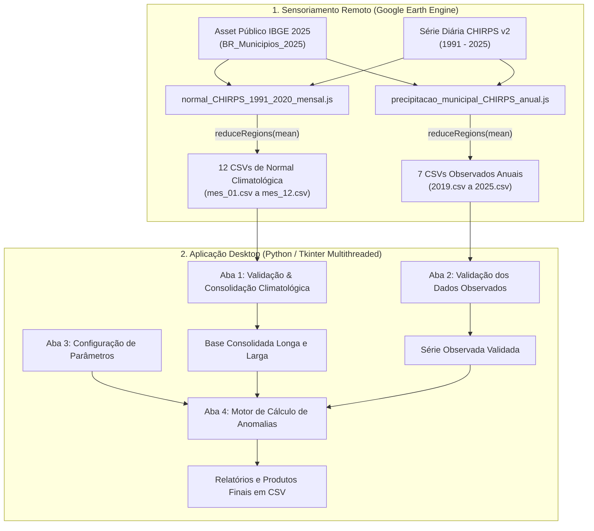

# Monitoramento e Cálculo de Anomalias de Precipitação CHIRPS por Município

Sistema integrado para extração de dados via **Google Earth Engine (GEE)** e processamento desktop em **Python (Tkinter/ttk)** para validação, consolidação climatológica e cálculo de anomalias de precipitação no Brasil em nível municipal.

---

## 📌 Contexto Legal e Propósito do Projeto

Este projeto foi desenvolvido para fundamentar tecnicamente as análises e decisões relacionadas à **[Medida Provisória nº 1.376/2026](https://www.planalto.gov.br/ccivil_03/_ato2023-2026/2026/mpv/mpv1376.htm)**, permitindo identificar com precisão geográfica e rigor científico os municípios impactados por anomalias extremas de precipitação (secas severas ou eventos pluviométricos extraordinários).

O sistema automatiza o cálculo da **Anomalia Relativa (%)** e da **Anomalia Absoluta (mm)** comparando as precipitações mensais observadas da série histórica do satélite **CHIRPS v2** (*Climate Hazards Group InfraRed Precipitation with Station data*) com a **Normal Climatológica de 30 anos (1991–2020)**.

### 🌍 Aplicações Práticas
* **Enquadramento em Normativos Federais (ex: MP 1376/2026)**: Subvenção, apoio financeiro e reconhecimento de calamidade pública ou emergência em municípios afetados por secas ou chuvas extremas.
* **Gestão de Recursos Hídricos & Comitês de Bacias**: Avaliação de impacto na disponibilidade hídrica e vazão de reservatórios.
* **Defesa Civil & Monitoramento de Desastres**: Identificação de municípios em risco iminente de desabastecimento ou inundação.
* **Agronegócio & Seguro Agrícola**: Mapeamento de quebra de safra por estresse hídrico.

---

## 🏗️ Arquitetura e Fluxo de Dados



---

## 📂 Estrutura do Repositório

```text
MP1376/
├── GEE_Scripts/                              # Scripts em JavaScript para execução no Google Earth Engine
│   ├── normal_CHIRPS_1991_2020_mensal.js     # Extrai a Normal Climatológica de 30 anos (1991-2020)
│   └── precipitacao_municipal_CHIRPS_anual.js# Extrai a chuva mensal observada (2019-2025)
├── app.py                                    # Interface Gráfica Tkinter/ttk multithreaded principal
├── validacoes.py                             # Regras de validação e verificação de arquivos climatológicos
├── climatologia.py                           # Consolidação dos 12 meses da normal em tabelas longa e larga
├── observados.py                             # Validação cadastral e temporal das séries observadas
├── parametros.py                             # Modelo de dados e perfis das 7 faixas de anomalia
├── anomalias.py                              # Motor de cálculo das anomalias e enquadramento nas faixas
├── config.py                                 # Constantes globais e padrões de caminhos/arquivos
├── perfis/                                   # Perfis salvos de parâmetros (JSON)
├── assets/                                   # CSVs base pré-carregados (12 meses climatologia + 7 anos observados)
│   └── consolidado/                          # Produtos finais e relatórios gerados localmente pela aplicação
├── .gitignore                                # Regras de exclusão do Git
└── README.md                                 # Documentação oficial do repositório
```

---

## ⚙️ Pré-requisitos e Instalação

### 1. Dependências do Sistema
* **Python 3.12 ou superior**
* **Google Earth Engine (Opcional)**: Apenas se desejar extrair novos dados para outros anos via GEE.

### 2. Instalação das Bibliotecas Python
Recomenda-se utilizar um ambiente virtual (`venv` ou `conda`):

```bash
# Clonar o repositório
git clone https://github.com/SEU_USUARIO/MP1376.git
cd MP1376

# Ativar seu ambiente virtual (exemplo conda ou venv)
# conda activate geocore

# Instalar dependências (pandas e ruff para desenvolvimento)
pip install pandas ruff
```

---

## 🚀 Guia de Uso Passo a Passo

> [!TIP]
> **Execução Imediata (Out of the Box)**: O repositório já inclui na pasta `assets/` todos os dados base de entrada necessários (12 arquivos da Climatologia Normal 1991–2020 e 7 arquivos de Séries Observadas 2019–2025). Você pode ir direto para o **Passo 2** e rodar a aplicação Python (`python app.py`) imediatamente! O **Passo 1 (GEE)** é necessário apenas caso queira gerar dados para outros anos.

### Passo 1: Gerar Novos Dados no Google Earth Engine (Opcional)

1. Abra o [Google Earth Engine Code Editor](https://code.earthengine.google.com/).
2. Os scripts utilizam o Asset de malha municipal `'projects/ee-atrigarashi/assets/IBGE/BR_Municipios_2025'`, que está **público e compartilhado para leitura**, permitindo que os scripts funcionem de forma pronta para qualquer usuário do Earth Engine.
3. Execute o script `GEE_Scripts/normal_CHIRPS_1991_2020_mensal.js` para gerar os 12 arquivos mensais de climatologia normal (`normal_CHIRPS_1991_2020_mes_01.csv` até `mes_12.csv`) no seu Google Drive (pasta `GEE_precipitacao`).
4. Execute o script `GEE_Scripts/precipitacao_municipal_CHIRPS_anual.js` para gerar os CSVs de precipitação observada por ano (`precipitacao_municipal_CHIRPS_2019.csv` a `2025.csv`).
5. Faça o download dos CSVs exportados do Google Drive e salve-os na pasta local `assets/`.

### Passo 2: Executar a Aplicação Desktop Python

Inicie a interface gráfica:

```bash
python app.py
```

A aplicação será aberta com 4 abas estruturadas:

1. **Aba 1 (Climatologia)**: Clique em *Verificar Climatologia*. Se os 12 arquivos mensais estiverem corretos, clique em *Consolidar Climatologia*.
2. **Aba 2 (Dados Observados)**: Clique em *Verificar Dados Observados* para validar os anos encontrados contra a base municipal.
3. **Aba 3 (Parâmetros)**: Inspecione ou ajuste as 7 faixas de classificação da razão $\frac{\text{Observado}}{\text{Normal}}$. Visualize o gradiente colorido no Canvas gráfico e salve/carregue perfis JSON conforme necessário.
4. **Aba 4 (Processar Anomalias)**: Clique em *Revisar Pré-requisitos* e, em seguida, em *Processar Anomalias*. O processamento será executado em segundo plano com animação contínua da barra de progresso.

---

## 📊 Faixas Padrão de Classificação de Anomalia

As anomalias são classificadas segundo a razão $R = \frac{\text{Precipitação Observada (mm)}}{\text{Normal Climatológica (mm)}}$:

| Faixa | Limites da Razão ($R$) | Anomalia Relativa (%) | Descrição |
| :--- | :---: | :---: | :--- |
| **MUITO_ABAIXO** | $R < 0,40$ | $< -60\%$ | Chuva severamente abaixo da média histórica |
| **ABAIXO** | $0,40 \le R < 0,60$ | $-60\% \text{ a } -40\%$ | Chuva moderadamente abaixo da média |
| **LIGEIRAMENTE_ABAIXO** | $0,60 \le R < 0,80$ | $-40\% \text{ a } -20\%$ | Chuva ligeiramente abaixo da média |
| **PROXIMO_DA_NORMAL** | $0,80 \le R \le 1,20$ | $-20\% \text{ a } +20\%$ | Precipitação dentro do padrão climatológico |
| **LIGEIRAMENTE_ACIMA** | $1,20 < R \le 1,40$ | $+20\% \text{ a } +40\%$ | Chuva ligeiramente acima da média |
| **ACIMA** | $1,40 < R \le 1,60$ | $+40\% \text{ a } +60\%$ | Chuva moderadamente acima da média |
| **MUITO_ACIMA** | $R > 1,60$ | $> +60\%$ | Chuva severamente acima da média histórica |

---

## 📄 Produtos e Relatórios Gerados

Ao finalizar o processamento na **Aba 4**, os produtos são gravados na pasta `assets/consolidado/`:

* `climatologia_CHIRPS_1991_2020_formato_longo.csv`: Base consolidada dos 12 meses de normal por município.
* `anomalias_CHIRPS_mensais.csv`: Tabela com precipitação observada, normal, anomalia absoluta (mm), anomalia relativa (%) e classe enquadrada.
* `relatorio_qualidade_CHIRPS.csv`: Relatório de integridade com identificação de dados nulos, negativos ou sem cobertura.

---

## 📜 Licença e Fonte dos Dados

* **Normativo de Referência**: [Medida Provisória nº 1.376/2026](https://www.planalto.gov.br/ccivil_03/_ato2023-2026/2026/mpv/mpv1376.htm).
* **Precipitação Satélite**: [CHIRPS v2](https://www.chc.ucsb.edu/data/chirps) — *Climate Hazards Center / University of California, Santa Barbara*.
* **Malha Territorial**: [IBGE](https://www.ibge.gov.br/) — *Instituto Brasileiro de Geografia e Estatística*.
